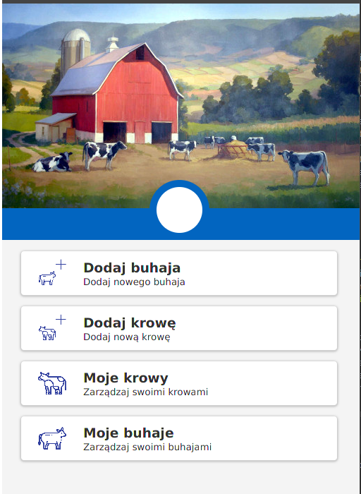

# eStatistic-desktop

Desktop application written in Kotlin, for learning purposes.

Uses a tornadoFX framework based on JavaFX. 

App is still in development phase, so above image is only example screen of application.
